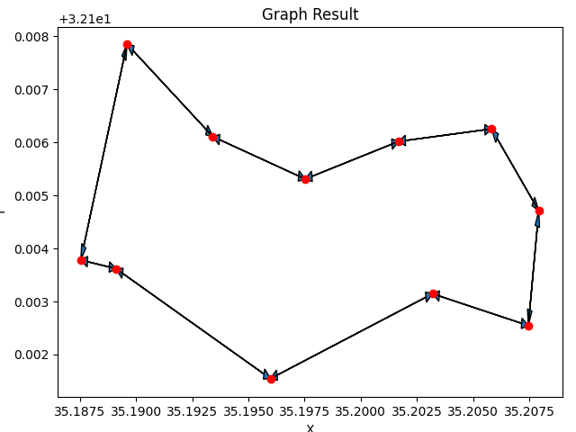

# OOP-Ex3
 
In this project we built a directed graph which is also a weighted graph. Also in this project you will find some algorithms that can be done on a graph that is both directed and weighted.

For more information:

https://en.wikipedia.org/wiki/Directed_graph

https://en.wikipedia.org/wiki/Graph_(discrete_mathematics)

|V|=4 , |E|=5.

0: 1: |edges out| 2 |edges out| 4.
1: 2: |edges out| 3 |edges in| 1 |edge in| 4.
2: 3: |edges out| 4 |edges in| 2.
3: 4: |edges out| 2 |edges in| 1	|edges in| 3.

Here are the departments that build our graph: Node class: This class represents the vertices, when each vertex has the following properties:

Key: An integer representing the "ID" of the vertex. The key must be unique, meaning there must be no more vertex in the graph with the same key. Note that once the vertex is created, the key field cannot be reset.

Point: Represents the position on the axes -X, Y, Z. We are working on a two-dimensional graph and it is therefore best to determine Z = 0 in advance

Weight: An actual number representing the cost of the shortest way to reach to the node, This parameter is designed for programmers to help us with the algorithms.

Tag: An integer to indicate that something happened or did not happen usually on this program, with this parameter, we checked whether or not we "visited" with a vertex. This parameter is designed for programmers to help us with the algorithms.

Info: A string that can indicate more information about the vertex. Usually in our program we used this field to keep from which vertex the shortest way to get to that vertex. This parameter is designed for programmers to help us with the algorithms.

Edge class: This class represents the edges, when each edge has the following properties:

Src(id1 in function short_way): An integer that represents the source vertex key

Dest(id2 in function short_way): An integer representing the key of the destination vertex

Weight: Actual number representing the cost of moving from one vertex of the edge to the other vertex of the edge. The only way to reset the weight is by an connect function in class DGraph, where if the edge we received is already exists we delete it and instead determine the new edge -the edge we received, so it is the only way to update the edge's weight because there is no set in the weight field Note that the weight of the edges can only be greater than 0

DiGraph class: This class is designed to build a graph that is both directed and weighted, by adding nodes and edges. when each graph has the following properties:

v_size: Count the number of vertices in the graph.

e_size count: Count the number of edges in the graph.

def get_all_v: The field contains a data structure called dict that stores all the vertices of the graph.

all_in_edges_of_node:The field contains a key called dict , to save all the edges entering in the point of the key.

all_out_edges_of_node:The field contains a key called dict , to save all the edges living the point of the key.

add_edge: The function recieve id1 and id2 and Adds an edge from id1 to id2, to the graph.

add_node: Adds a node to the graph.

remove_node: Removes a node from the graph

remove_edge: Removes an edge from the graph.

Graph_Algo class: The Graph Algo class contains all algorithms that can be run on a graph. The algorithms are:

Init: Allows to insert a graph into the Graph Algo class so that we can run algorithms on it.

get_graph: The directed graph on which the algorithm works on.

load_from_json: Loads a graph from a json file.

save_to_json: Allows to save a graph into a Json file.

shortestPath: Returns the shortest path from node id1 to node id2 using Dijkstra's Algorithm with complexity of O(nlogv + v) (n - number of vertx).

connected_component: Finds the Strongly Connected Component(SCC) that node id1 is a part of.

connected_components: Finds all the Strongly Connected Component(SCC) in the graph.

isConnected: Checks whether the graph is strongly related, that is, if for any two vertices in the graph we mark them in u, v there is a path between u and v and there is a path between v and u.

plot_graph: Plots the graph.

Graph plots:

